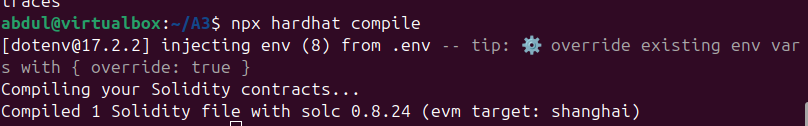
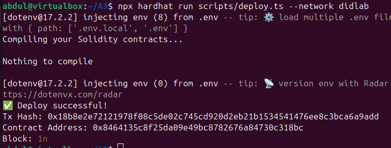
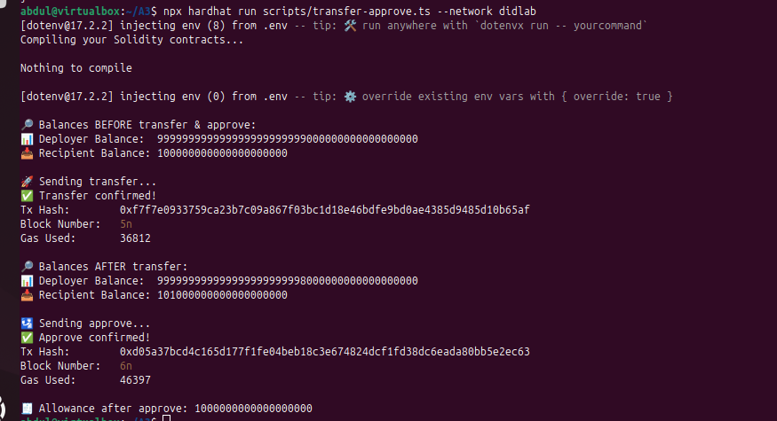
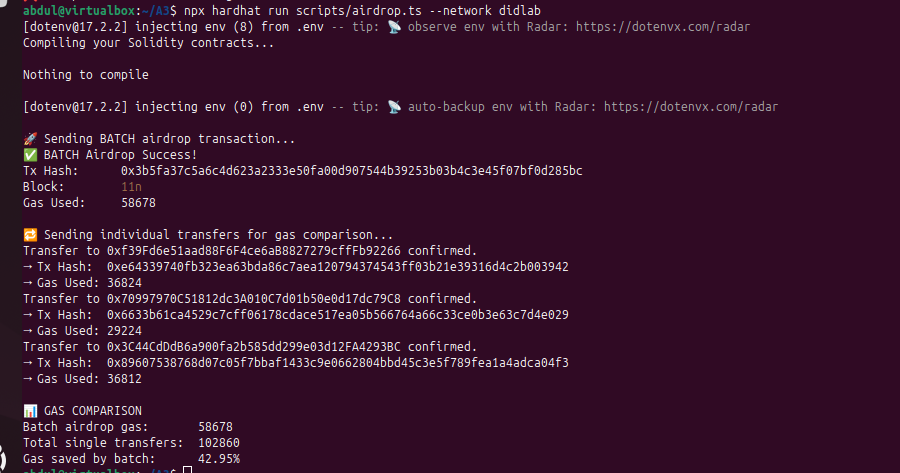
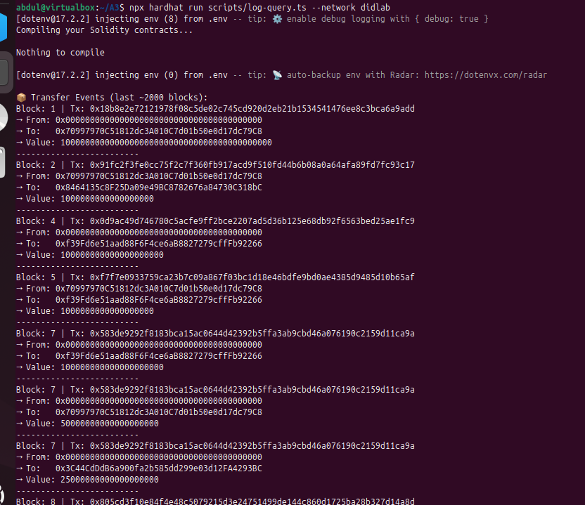
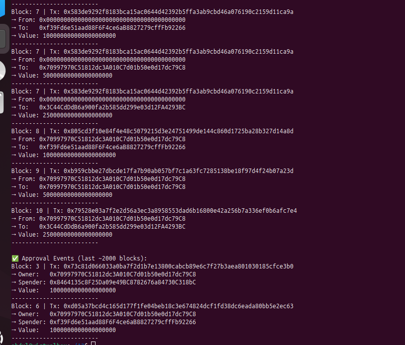
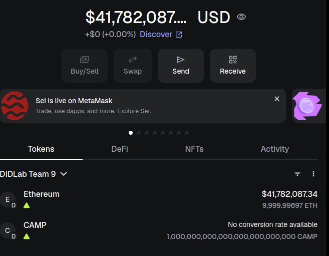

# CampusCredit Token Scripts

This project contains scripts to deploy, transfer, approve, airdrop, and read events for the `CampusCredit` ERC-20 token contract.

---

## Prerequisites

- Node.js installed (v16+ recommended)
- Dependencies installed (`npm install` or `yarn install`)
- A `.env` file configured with the following variables:

RPC_URL=<your_rpc_url>
CHAIN_ID=<your_chain_id>
PRIVATE_KEY=<your_private_key>
TOKEN_ADDRESS=<deployed_token_contract_address>


---

## Scripts Overview

### 1. Deploy Token

Deploys the `CampusCredit` token contract using parameters in `.env`.

- Prints:
  - Deployment transaction hash
  - Deployed contract address
  - Deployment block number
Run:

```bash
node deploy.ts
```

**Note:** After deployment, update your `.env` with the new `TOKEN_ADDRESS`.

### 2. Transfer & Approve

- Prints balances for deployer and recipient (before and after)
- Transfers tokens from deployer to recipient
- Approves recipient to spend tokens
- Prints transaction hashes, block numbers, and gas used

Run:

```bash
node transfer-approve.ts
``` 
### 3.Batch Airdrop

-Sends batch airdrop to multiple recipients
-Compares gas cost to sending individual transfers (singles)
-Prints transaction hashes, block numbers, and gas usage summary

Run:
```bash
node airdrop.ts
``` 

### 4.Logs & Events

-Fetches and displays Transfer and Approval events from the last ~2000 blocks

Run:
```bash
node log-query.ts
``` 

### Screenshots














